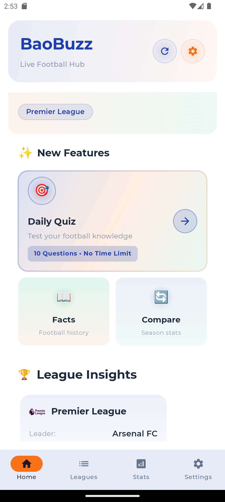
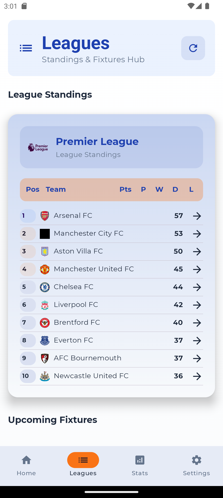
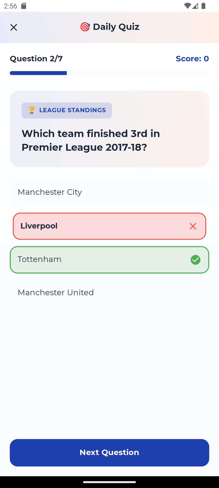
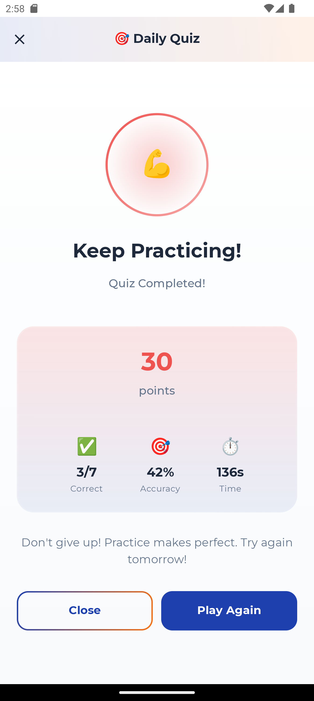
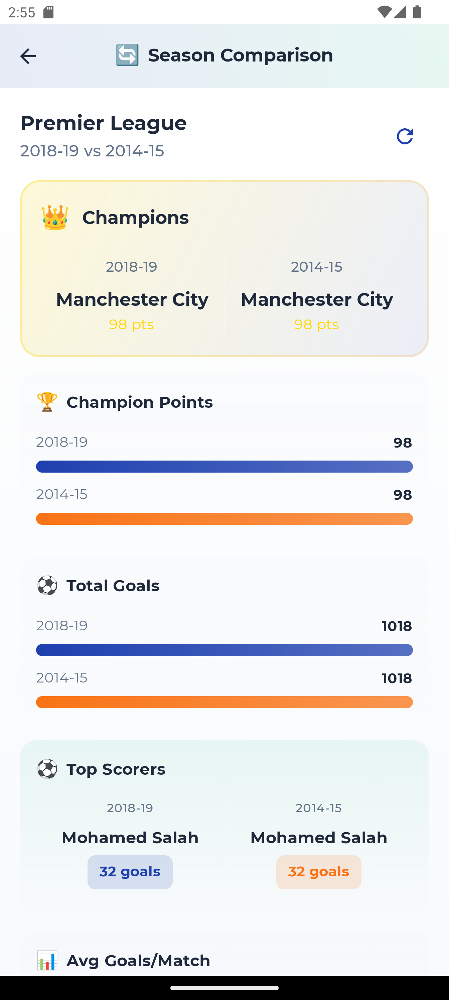
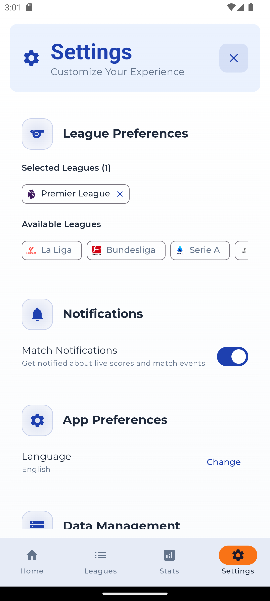

# BaoBuzz


A football companion app for Android built with Kotlin and Jetpack Compose. Covers live league standings, a daily quiz, season-by-season comparisons, and player stats — all backed by a multi-API data layer with aggressive caching.

## Screenshots

<table>
  <tr>
    <td align="center"><br/><sub>Home</sub></td>
    <td align="center"><br/><sub>Leagues</sub></td>
    <td align="center"><br/><sub>Quiz</sub></td>
  </tr>
  <tr>
    <td align="center"><br/><sub>Quiz Results</sub></td>
    <td align="center"><br/><sub>Season Comparison</sub></td>
    <td align="center"><br/><sub>Settings</sub></td>
  </tr>
</table>

## Tech Stack

| Layer | Technology |
|---|---|
| Language | Kotlin 1.9.20 |
| UI | Jetpack Compose (Material 3) |
| Architecture | MVVM with Clean Architecture layers |
| DI | Hilt (with KSP) |
| Networking | Retrofit 2.9 + OkHttp 4.12 |
| Database | Room 2.6 |
| Preferences | DataStore |
| Navigation | Navigation Compose 2.7 |
| Image Loading | Coil 2.5 |
| Async | Coroutines + StateFlow |
| Serialization | Kotlinx Serialization |
| Scheduling | WorkManager |
| Logging | Timber |

## Architecture

```
app/src/main/java/com/msdc/baobuzz/
├── core/
│   ├── api/              # Retrofit interfaces, repository, request tracking
│   ├── cache/            # In-memory + Room caching layer
│   ├── database/         # Room DB, DAOs, entities
│   ├── di/               # Hilt modules (Network, Database, DataStore, Dispatchers)
│   ├── models/           # Domain models (@Immutable/@Stable annotated)
│   ├── navigation/       # Route definitions, NavHost setup
│   └── preferences/      # DataStore-backed user preferences
├── features/
│   ├── home/             # Dashboard with league insights + feature cards
│   ├── leagues/          # League standings table, fixtures, results
│   ├── stats/            # Player statistics
│   ├── quiz/             # Daily quiz (multiple choice, score tracking)
│   ├── facts/            # Historical football facts
│   ├── comparison/       # Season-vs-season stat comparison
│   ├── settings/         # League selection, notifications, preferences
│   ├── onboarding/       # First-launch league selection flow
│   └── main/             # Scaffold + bottom navigation host
├── presentation/
│   ├── components/       # Shared UI components (loading, error, empty states)
│   ├── screens/          # Team detail, player detail, match detail, search
│   └── transfers/        # Transfer news screen
└── ui/theme/             # Color scheme, typography, glassmorphism utilities
```

~130 Kotlin files. Each feature follows the `Screen + ViewModel` pattern. ViewModels expose `StateFlow<UiState>`, screens collect via `collectAsStateWithLifecycle()`.

### Data Flow

```
UI (Compose) → ViewModel (StateFlow) → Repository → Cache check → API call → Room persistence
```

The `FootballRepository` implements cache-first reads:
1. Check `FootballDataCache` (in-memory + Room)
2. If stale or missing, hit the API
3. Persist response to Room, update in-memory cache
4. `ApiRequestTracker` enforces rate limits to stay within free tier quotas

### API Layer

The app integrates with multiple football data APIs:

- **api-sports.io** — Primary source for live match data, standings, player stats. Auth via header interceptor. Free tier: 100 requests/day.
- **football-data.org** — Secondary source for standings and fixtures. Free tier: 10 requests/min.
- **OpenFootball** — Historical match data used by the quiz and comparison features. No auth required.

API keys are loaded from `local.properties` via `BuildConfig` fields. The multi-API setup provides redundancy and keeps costs at zero.

### Dependency Injection

All wiring is in `core/di/` via Hilt modules:

- `NetworkModule` — Retrofit instances, OkHttp client with auth/rate-limit interceptors
- `DatabaseModule` — Room database singleton, DAO providers
- `DataStoreModule` — DataStore preferences instance
- `FootballModule` — Repository bindings
- `DispatcherModule` — Named coroutine dispatchers (IO, Default, Main)

### Navigation

Two-level `NavHost` setup:

1. **Root NavHost** (`BaoBuzzNavigation.kt`) — Splash, Onboarding, Main App, standalone screens (quiz, facts, comparison, transfers, team/player/match detail)
2. **Nested NavHost** (`MainAppScreen.kt`) — Bottom nav tabs: Home, Leagues, Stats, Settings

Route constants live in `BaoBuzzRoutes.kt`. All transitions use fade + slide animations.

## Compose Performance

The codebase follows strict Compose performance practices:

- **File-level composables only** — zero nested `@Composable` function definitions. Prevents re-creation on every recomposition.
- **Lazy list keys on all lists** — every `LazyColumn`/`LazyRow` uses `key = { item.id }` for efficient diffing.
- **Stability annotations** — 40+ data classes annotated with `@Immutable` or `@Stable` so Compose can skip recomposition when inputs haven't changed.

## Setup

**Requirements:** Android Studio Hedgehog+, JDK 17+

1. Clone the repo
   ```bash
   git clone https://github.com/muchaisam/BaoBuzz.git
   ```

2. Create `local.properties` in the project root:
   ```properties
   API_KEY=your_api_sports_key
   FOOTBALL_DATA_API_KEY=your_football_data_key
   ```
   Get keys from [api-sports.io](https://api-sports.io/) and [football-data.org](https://www.football-data.org/). Both have free tiers.

3. Build and run:
   ```bash
   ./gradlew assembleDebug
   ```

The quiz, facts, and comparison features work without API keys (they use bundled/OpenFootball data). Live standings and fixtures require at least one key.

## Build Commands

```bash
./gradlew assembleDebug          # Debug APK
./gradlew assembleRelease        # Release APK (minified + shrunk)
./gradlew test                   # Unit tests
./gradlew connectedAndroidTest   # Instrumented tests
./gradlew clean                  # Clean build artifacts
```

Release builds have `isMinifyEnabled = true` and `isShrinkResources = true` via R8.

## License

MIT License. See [LICENSE](LICENSE).

## Author

**Samuel Muchai** — [@muchaisam](https://github.com/muchaisam)
